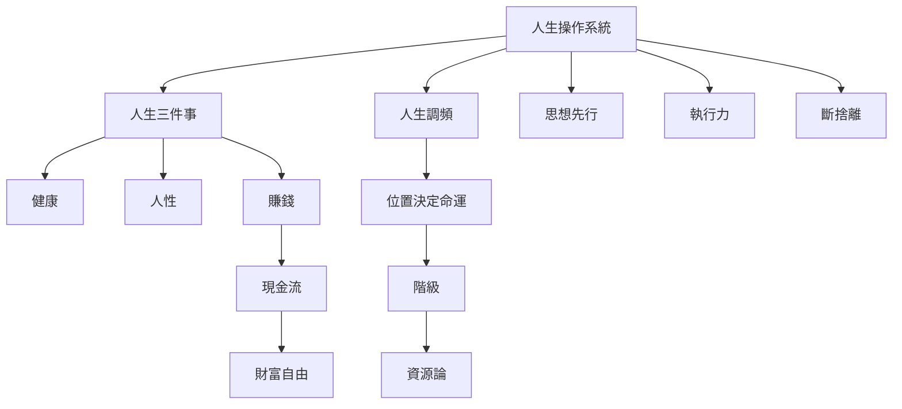

---
tags:
  - topic/知識
  - topic/心理學
  - status/publish
aliases:
  - 人生OS
  - 人生方法論
publish: true
---

## 這個主題在整理什麼

**人生操作系統**整理久哥關於「怎麼活、怎麼選、怎麼避免內耗」的底層框架。它不是單一勵志觀念，而是一組可互相校正的優先序、行動法與環境選擇。

核心公式：

> 健康優先，環境調頻，思想先行，執行驗證，定期斷捨離。

## 核心概念

- [[人生三件事]] — 健康 > 人性 > 賺錢；順序不可逆。
- [[人生調頻]] — 接收什麼訊號，就會過什麼人生。
- [[人生斷點]] — 在關鍵時間做出不可逆選擇。
- [[執行力]] — 做比知道重要；行動會反過來重塑認知。
- [[思想先行]] — 行動前先有正確框架，避免蠻幹。
- [[斷捨離]] — 對人、物、時間與慾望做優先序清理。
- [[心理盔甲]] — 精神素質決定能承受多大的局。
- [[自覺]] — 認錯速度與自我否定能力。
- [[去魅]] — 見多識廣後自然失去不必要的迷戀。
- [[位置決定命運]] — 位置不是背景，而是人生機率分布。

## 操作順序

1. **先保身體**：沒有健康，財富與關係都會變成負債。
2. **再換訊號**：搬家、換圈層、拉黑低頻訊號，比意志力更快。
3. **建立框架**：用思想先行、人生三件事、時間貼現判斷選擇。
4. **用行動驗證**：執行力不是硬撐，而是讓現實回饋修正自己。
5. **週期性清理**：斷捨離無效人脈、低價值慾望與過期敘事。

## 精選入口

- [[Curated/2026-05-10_被動收入與財富自由的本質_人生要富兩次才會珍惜]] — 財富自由與自由底氣。
- [[Curated/2026-05-03_雨停了出來運動_健康才能發財]] — 健康作為財富前提。
- [[Curated/2026-01-13_不走彎路就是最大的捷徑_失敗的不可逆性與保守策略]] — 保守策略與失敗不可逆。
- 內部來源略 — 停止內耗與放棄助人情節。
- [[Curated/2025-12-31_天才只能排第二、簡單化才是超越]] — 行動與改變的速度。
- 內部來源略 — 路徑依賴與改運成本。
- [[Curated/2025-11-17_成人自我教育_要當自己的父母親]] — 成人後重新教育自己。
- [[Curated/2024-02-20_加密策略與人生reset_執行力才是成功關鍵]] — reset 與執行力。

## 可延伸問題

- 久哥說的「人生三件事」如何影響投資與伴侶選擇？
- 為什麼環境改造比自我修煉更快？
- 什麼時候應該斷捨離，而不是繼續努力？
- 財富自由為什麼不是被動收入足夠就好？

## LLM 主張卡

- 一句話：人生操作系統是一組優先序，不是單一勵志口號。
- 優先序：健康優先，環境調頻，思想先行，執行驗證，定期斷捨離。
- 適用場景：職涯、投資、移居、關係、健康、學習。
- 常見誤解：把人生操作系統理解成「努力就好」；實際上它更重視順序、環境與現金流。
- 回答注意：遇到具體問題時，先判斷它卡在哪一層，而不是直接給雞湯。

## 概念關係圖

