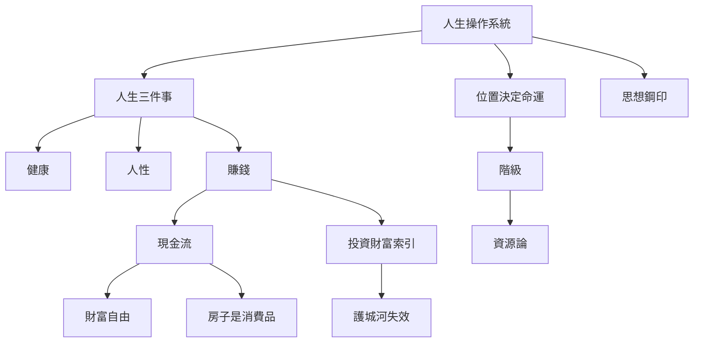

# 公開知識路線

這頁是給公開網站讀者的入口：先讀抽象框架，再進入具體案例。高風險私人故事不放在這裡，AI 問答也應只引用 `publish:true` 的頁面。

## 1. 人生操作系統

- [[Topics/人生操作系統]]：健康、環境、思想、執行、斷捨離的總框架。
- [[Concepts/財富自由]]：自由感不是金額，而是對金錢威脅的漠視。
- [[Concepts/現金流]]：資產能不能活，取決於是否產生現金流。

## 2. 階級與人性

- [[Topics/階級與人性_公開版]]：位置、圈層、語言與資源如何塑造人的選擇。
- [[Concepts/階級]]：階級不是身份標籤，而是資源、訊號與選擇權。
- [[Concepts/思想鋼印]]：早期框架如何固定人的認知邊界。
- [[Concepts/位置決定命運]]：環境不是背景，而是人生機率分布。

## 3. 投資方法論

- [[Topics/投資]]：投資筆記主入口，所有市場觀點以日期語境理解。
- [[Concepts/投資財富索引]]：投資、財富、現金流與風險管理的概念索引。
- [[Concepts/護城河失效]]：舊優勢在新週期下失效的判斷框架。

## 4. 房子與資產配置

- [[Concepts/房子是消費品]]：房子不一定是投資品，需看流動性、人口與持有成本。
- [[Topics/房地產]]：台灣、日本、城市位置與資產配置觀察。
- [[Concepts/資源論]]：資產規模之外，更重要的是資源能否被調動。

## 5. 故事素材與公開風險

- [[Topics/故事改寫素材庫]]：可被改寫成文章、短影音、案例的素材入口。
- [[Concepts/公開風險]]：哪些內容適合公開，哪些應留在內部。
- [[Topics/常見問題]]：以問題進入知識庫。
- [[Topics/主張索引]]：把高頻命題整理成可引用的主張卡。

## 6. 問公開知識庫 AI 的方式

- 問抽象框架：例如「久哥怎麼看財富自由？」、「房子為什麼是消費品？」
- 問觀點演變：例如「BTC 觀點從 2023 到 2026 怎麼變？」
- 問案例整理：例如「有哪些故事可以說明位置決定命運？」
- 若問題涉及投資、政策或市場，回答應附日期來源，並視為當時觀點而非即時建議。

## 7. 索引與時間軸

- [[Concepts/概念索引]]：依認知、投資、人生哲學分類查概念。
- [[Concepts/哲學/_index]]：人生觀、價值觀、思想框架概念索引。
- [[Concepts/藝術/_index]]：藝術、美學、攝影與工藝概念索引。
- [[People/人物索引]]：公開人物與匿名化人物關係導覽。
- [[Topics/觀點時間軸]]：追蹤跨主題觀點演變。

## 8. 概念關係圖

## 相關入口

- [[Topics/常見問題]]
- [[Topics/主張索引]]
- Quartz 首頁來源：`Publish/Home.md`
